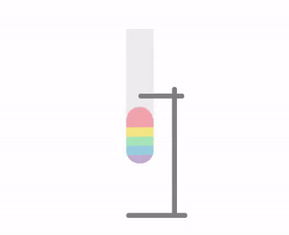
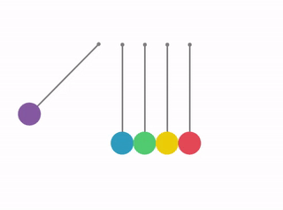

# loading-anim-CSS
Playing with CSS (only) to create loading animations.

## Here are the previews:
Each animation has its **own html file** (+ *Internal CSS Style Sheet*) in the <a href="loading/">loading folder</a>.

### Animation 1:

### Animation 2:

### Animation 3:

### Animation 4:

