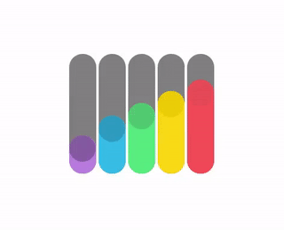

# loading-anim-CSS
Playing with CSS (only) to create loading animations.

Here are the previews:

Animation 1:

Animation 2:

Animation 3:

Each animation has its own html file (+ Internal CSS Style Sheet) in the loading folder.
